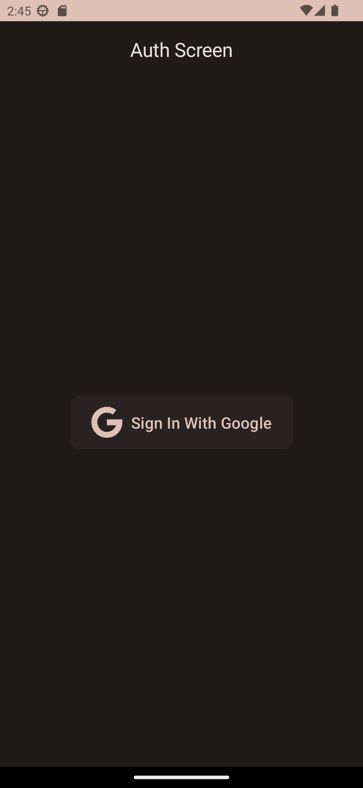

# GDG Cloud Chat
This app is really special for me its the first time i got a chance to give my first talk on 
**Google Cloud Community Days Coimbatore** stage so i made an anonymous global chat app to showcase
live chat app without realtime database.

Its first session from which my(an introvert) journey of giving public sessions/talks at tech events. 
Got an chance to meet and share stage such an amazing people.
You can check out the official post [here](https://twitter.com/GDGCloudCBE/status/1568865571642703873?s=20)

# Technologies used
- Jetpack Compose
- Material You
- Firebase one tap sign-in
- Firebase Firestore

# Screenshots
| Auth Screen                 | Chat Screen                          |
|-----------------------------|--------------------------------------|
|  |  |

# Thank You
Thank you for check it out and if you attended the event and liked my session a big thank you again.
Hope you have a good day and keep doing better.